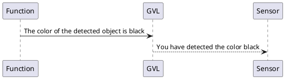

# Chapter 1

```plantuml
@startuml
participant Function 
Participant GVL
participant Sensor

Function -> GVL : The color of the detected object is black
GVL -->  Sensor : You have detected the color black


@enduml

```